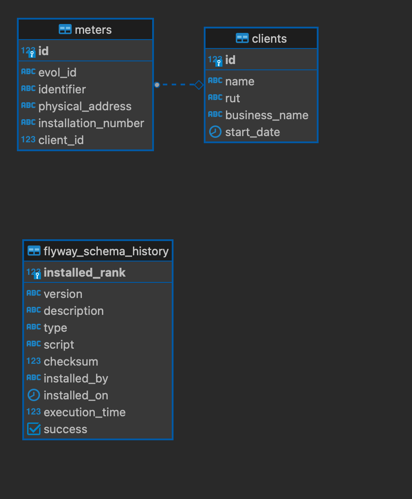

## Primeros pasos

La aplicación solo necesita que tengas creada la base de datos, ya que la estructura de la misma se crea automáticamente al iniciar la aplicación.

El script de la base de datos se encuentra en la carpeta script, y se llama ```base_script.sql``` este solo tiene la instrucción para crear la base de datos y de ser necesario agregar permisos al usuario.

En caso de que quieras cargar la estructura completa, utiliza el script ```complete_dump.sql``` que contiene la estructura necesaria para el funcionamiento la aplicación.

El modelo de datos es el siguiente:



Además, se incluye una colección de Postman para probar los servicios, esta se encuentra en la carpeta ```script``` y se llama ```challenge.postman_collection.json```

Nota: Importante no olvides configurar el archivo ```application.properties``` con las credenciales de tu base de datos.